# Project 01 — Splunk Deployment and Log Ingestion

## What I Did

I started this lab by building the logging environment I’ll use for the rest of the Splunk SOC projects.

I deployed Splunk Enterprise, created a dedicated index for Windows telemetry, and configured Windows Event Log collection. I then added Sysmon to get better visibility into endpoint activity such as process execution.

By the end of the lab, I could generate activity on the Windows host and find the corresponding events in Splunk.

---

## Setting Up the Windows Index

I created a dedicated Splunk index called:

```text
windows
```

I wanted the Windows security data separated from Splunk's own internal events so that later investigations would be easier to work with.

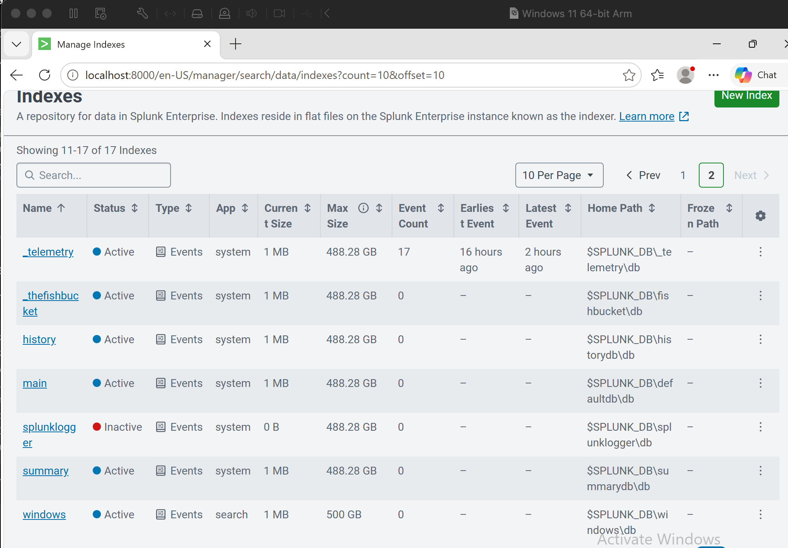

I then configured Splunk to collect the main Windows event channels I wanted for the lab:

- Security
- System
- Application

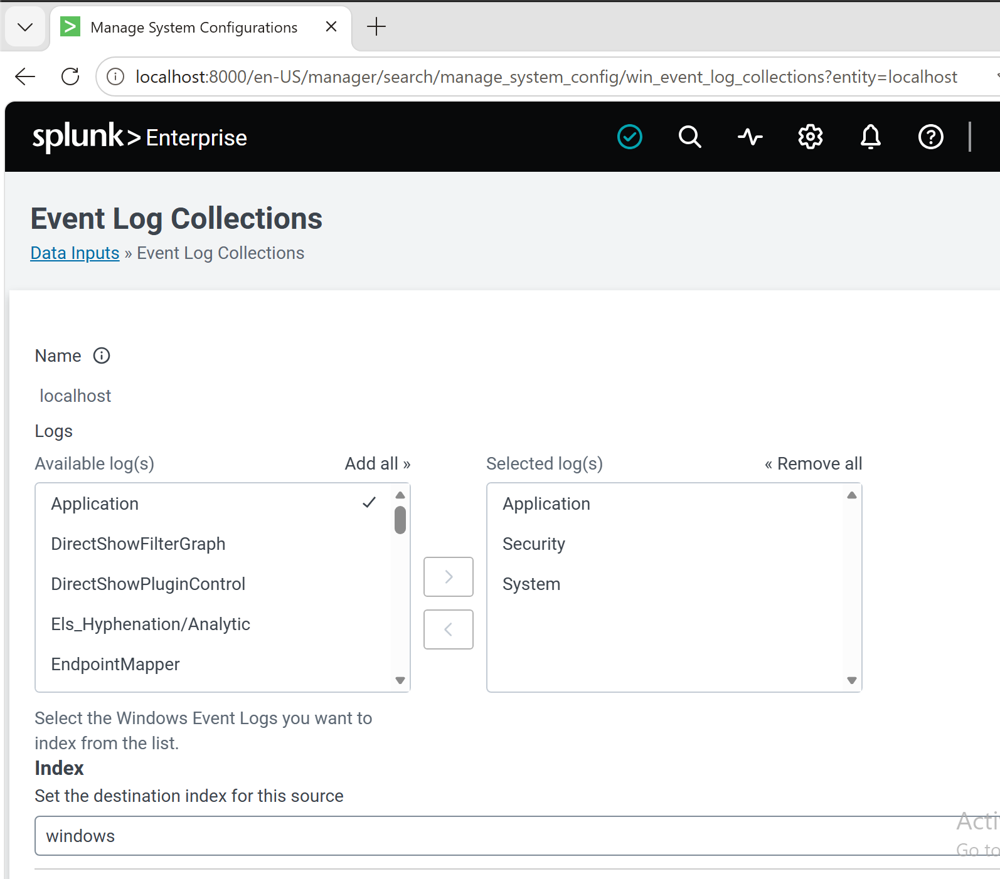

To make sure the data was actually arriving, I checked the available sources:

```spl
index=windows
| stats count by source
```

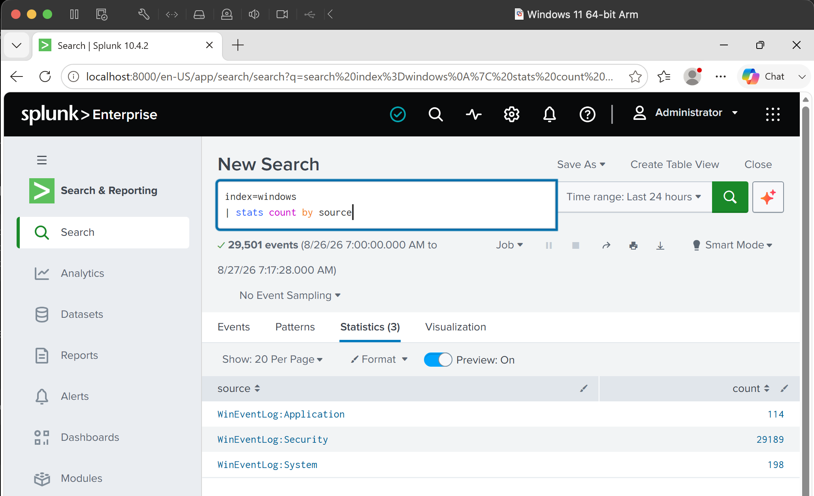

At this point I had the basic Windows logging pipeline working.

---

## Looking at Windows Security Events

Once the Security log was available, I started looking at the events rather than stopping at successful ingestion.

I checked which security Event IDs were appearing and then looked specifically at successful Windows logons.

```spl
index=windows source="WinEventLog:Security" EventCode=4624
```

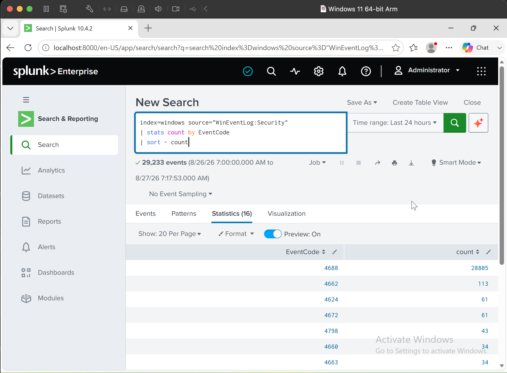

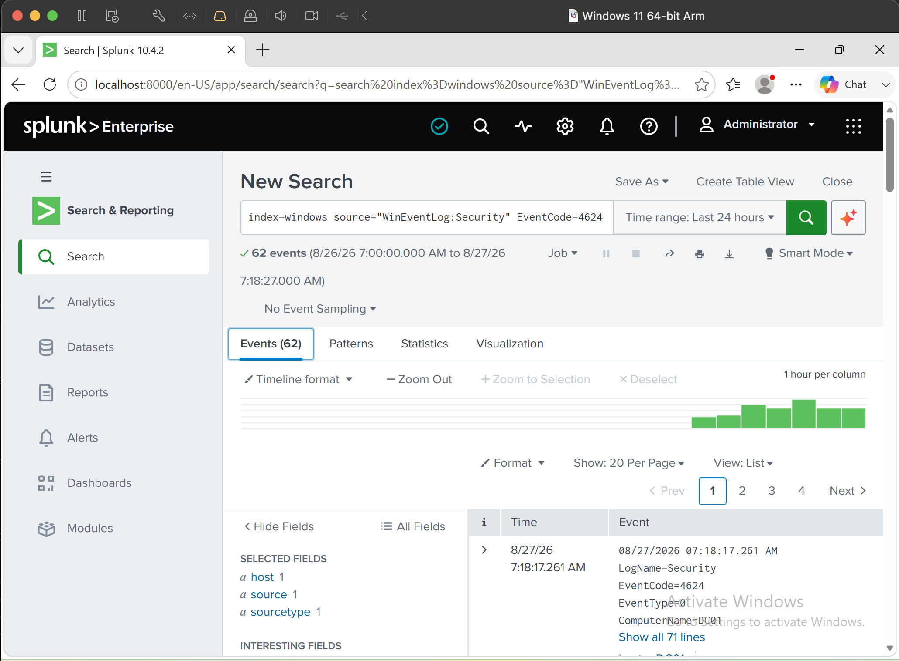

This gives me a baseline for the authentication investigations later in the lab series, where I’ll compare normal logons with failed and potentially suspicious authentication activity.

---

## Adding Sysmon

The standard Windows logs were useful, but I wanted more visibility into what was actually happening on the endpoint.

I installed Sysmon and verified that the service was running.

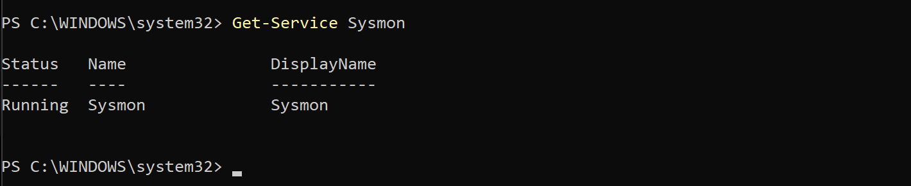

I also checked the Sysmon Operational log in Windows Event Viewer to confirm that events were actually being generated before trying to work with them in Splunk.

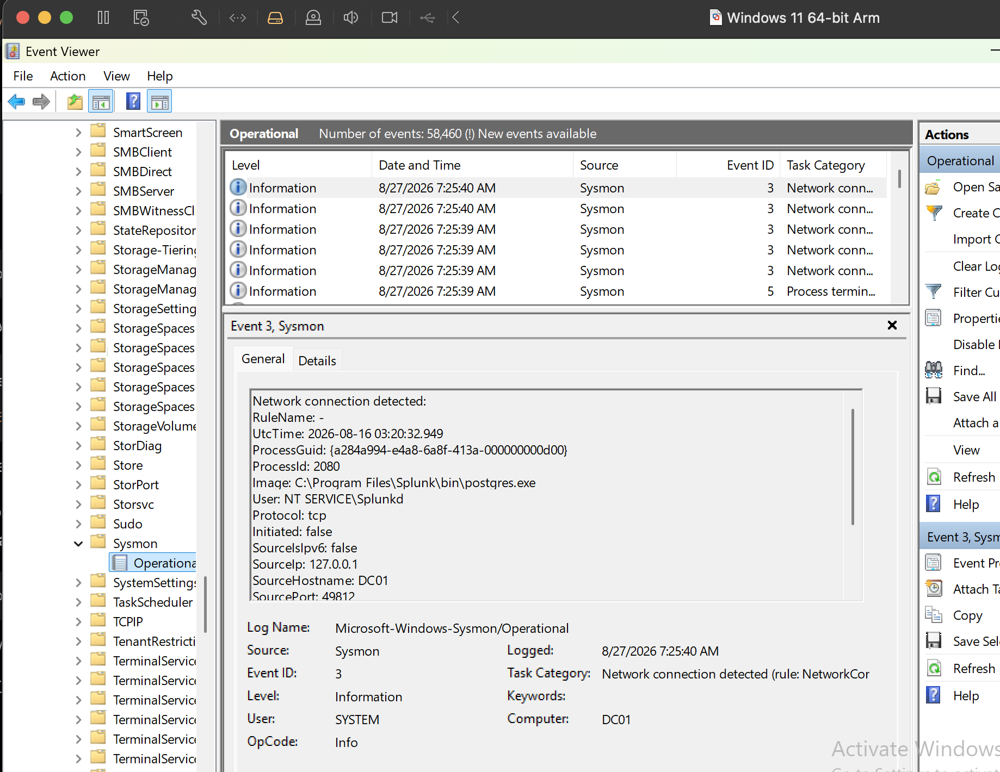

That gave me a simple checkpoint:

```text
Endpoint activity
       ↓
Sysmon
       ↓
Windows Event Log
```

The next step was getting that telemetry into Splunk.

---

## Getting Sysmon Into Splunk

This part needed some troubleshooting.

The Sysmon Operational channel did not initially appear where I expected in Splunk's Local Event Log Collection interface.

Instead of changing the Sysmon installation, I first checked whether the Windows log itself was working:

```powershell
Get-WinEvent -ListLog *Sysmon* |
Select-Object LogName, IsEnabled, RecordCount
```

The result confirmed that:

```text
Microsoft-Windows-Sysmon/Operational
```

was enabled and already contained thousands of events.

That told me Sysmon wasn't the problem.

After configuring Splunk to collect the Operational channel, I checked the `windows` index again.

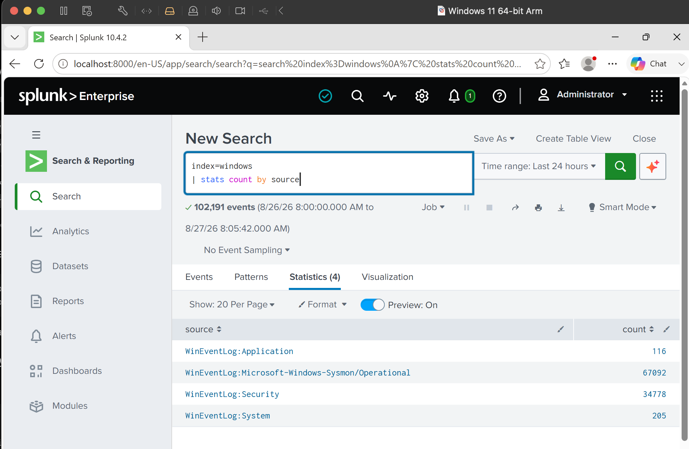

I could now see:

```text
WinEventLog:Application
WinEventLog:Microsoft-Windows-Sysmon/Operational
WinEventLog:Security
WinEventLog:System
```

Sysmon alone was already producing a large amount of endpoint telemetry.

I also confirmed its Splunk sourcetype:

```text
XmlWinEventLog:Microsoft-Windows-Sysmon/Operational
```

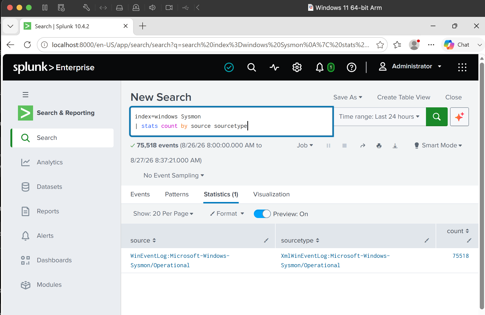

---

## Working With the Raw Sysmon Events

I ran into another issue when I started querying Sysmon.

I initially expected fields such as `EventCode` or `EventID` to be available directly. Some searches returned no results even though I already knew Splunk was receiving Sysmon events.

Opening one of the events showed what was happening.

The event was arriving as XML, with information such as:

```xml
<EventID>5</EventID>
```

and:

```xml
<Data Name='Image'>C:\Program Files\Splunk\bin\splunk-optimize.exe</Data>
<Data Name='User'>NT SERVICE\Splunkd</Data>
```

The telemetry was there. The issue was how the fields were being extracted and searched.

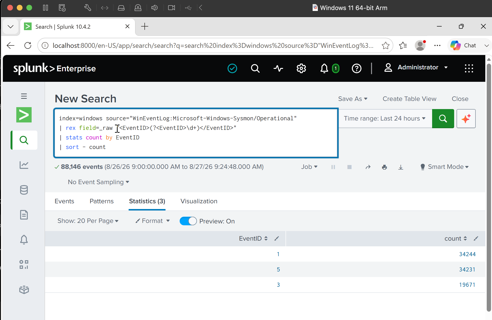

This was a useful distinction to make during troubleshooting:

```text
No search results
       ↓
Are logs actually reaching Splunk?
       ↓
Yes
       ↓
Inspect raw event
       ↓
Check event structure / field extraction
```

It stopped me from unnecessarily rebuilding a logging pipeline that was already working.

---

## Testing Endpoint Activity

Once the pipeline was working, I generated some known activity from the Windows host.

I used processes and commands including:

```text
PowerShell
CMD
Notepad
whoami
ipconfig
nslookup
```

Instead of just assuming Sysmon captured them, I searched the telemetry in Splunk.

For example:

```spl
index=windows source="WinEventLog:Microsoft-Windows-Sysmon/Operational" "notepad.exe"
```

I was able to find the process activity in the Sysmon events.

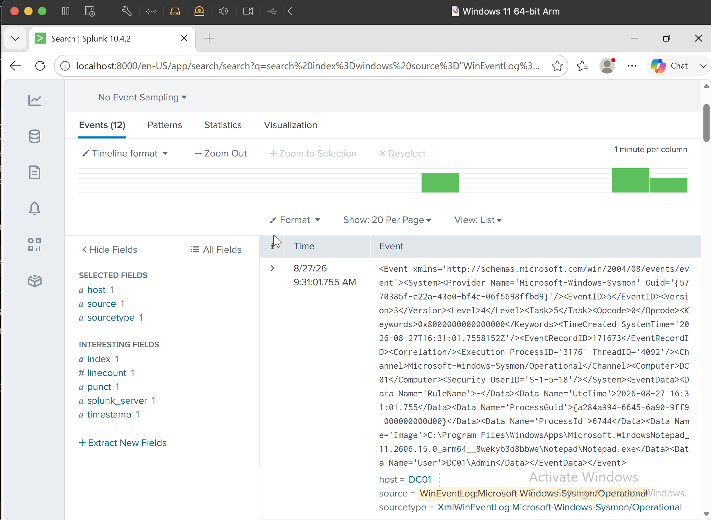

That completed the logging path I wanted for the lab:

```text
Process executed on Windows
          ↓
       Sysmon
          ↓
   Windows Event Log
          ↓
       Splunk
          ↓
   Search / Analysis
```

---

## Searches I Used

Check the available Windows sources:

```spl
index=windows
| stats count by source
```

Search Windows Security events:

```spl
index=windows source="WinEventLog:Security"
```

Find successful logons:

```spl
index=windows source="WinEventLog:Security" EventCode=4624
```

Search Sysmon telemetry:

```spl
index=windows source="WinEventLog:Microsoft-Windows-Sysmon/Operational"
```

Find a particular process:

```spl
index=windows source="WinEventLog:Microsoft-Windows-Sysmon/Operational" "notepad.exe"
```

---

## What I Took From This Lab

Getting Splunk installed wasn't the difficult part. The more useful experience came from working out why Sysmon searches weren't behaving as expected.

I learned to check each stage separately: confirm that Sysmon is running, confirm that Windows is recording the events, verify that Splunk is ingesting them, identify the actual source and sourcetype, and finally inspect the raw event when a field isn't behaving as expected.

With the telemetry pipeline working, the next project moves into **SPL and security log analysis** rather than more setup.