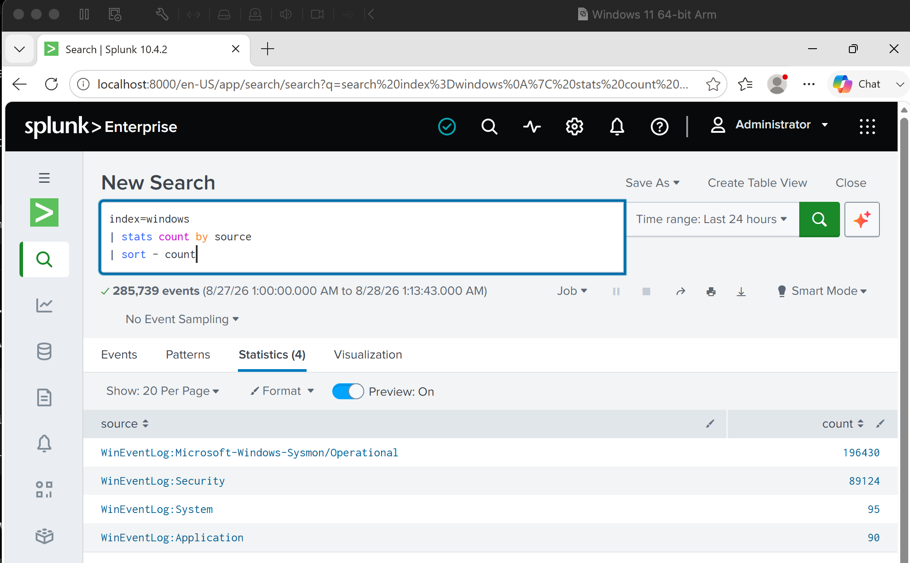
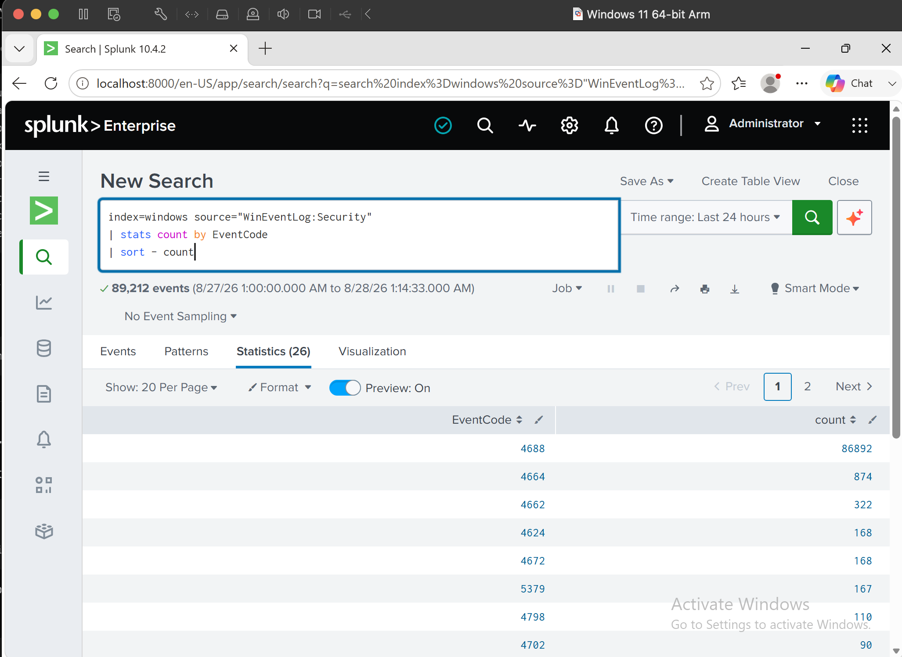
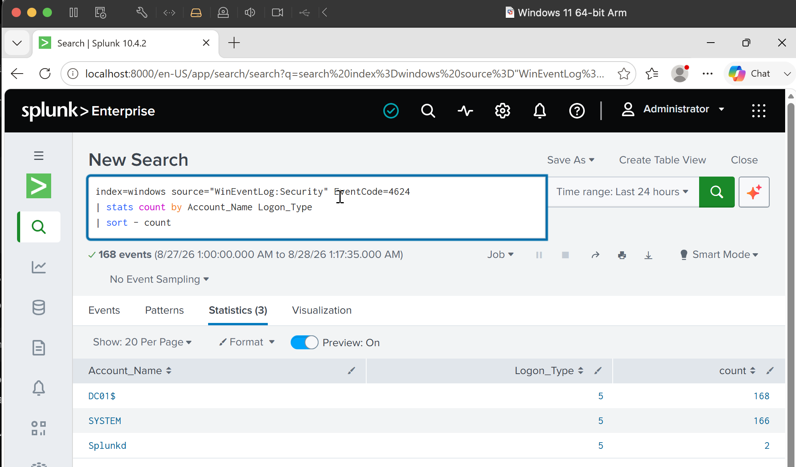
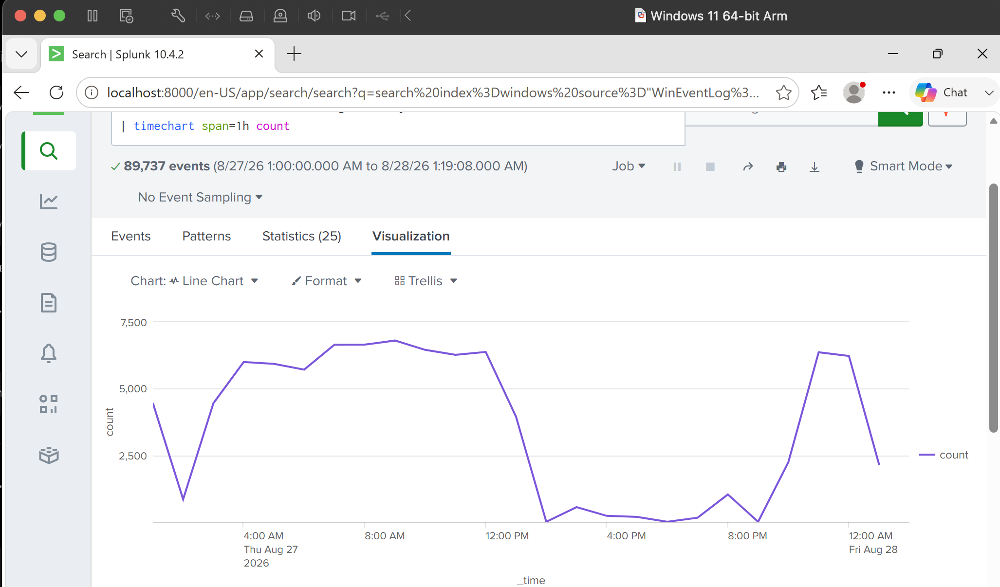
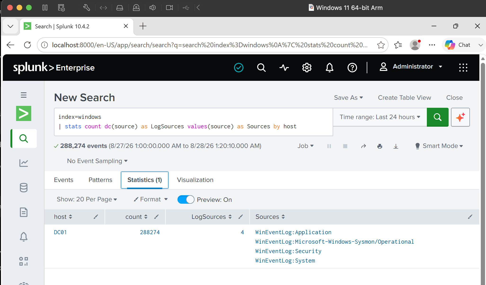
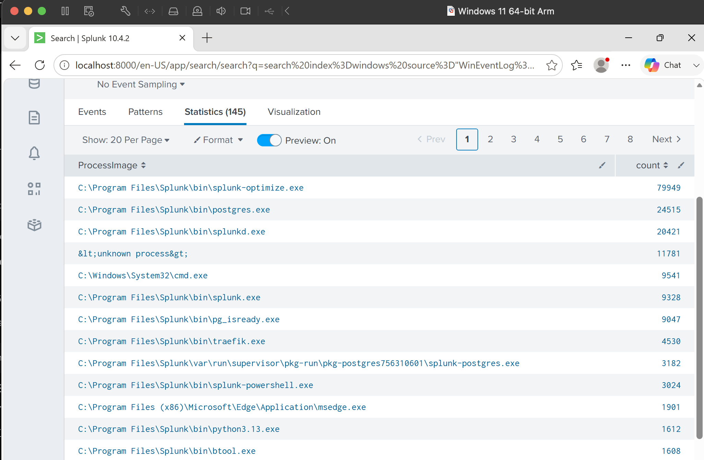
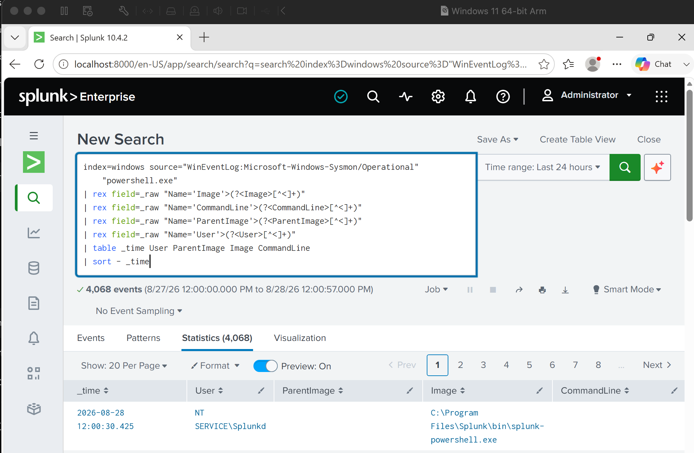
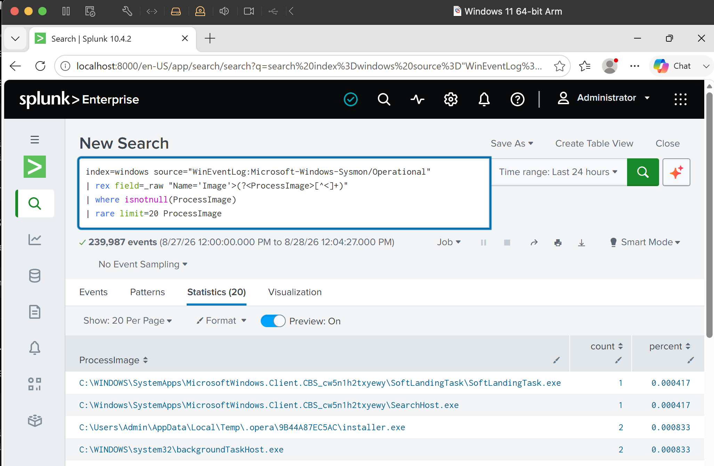
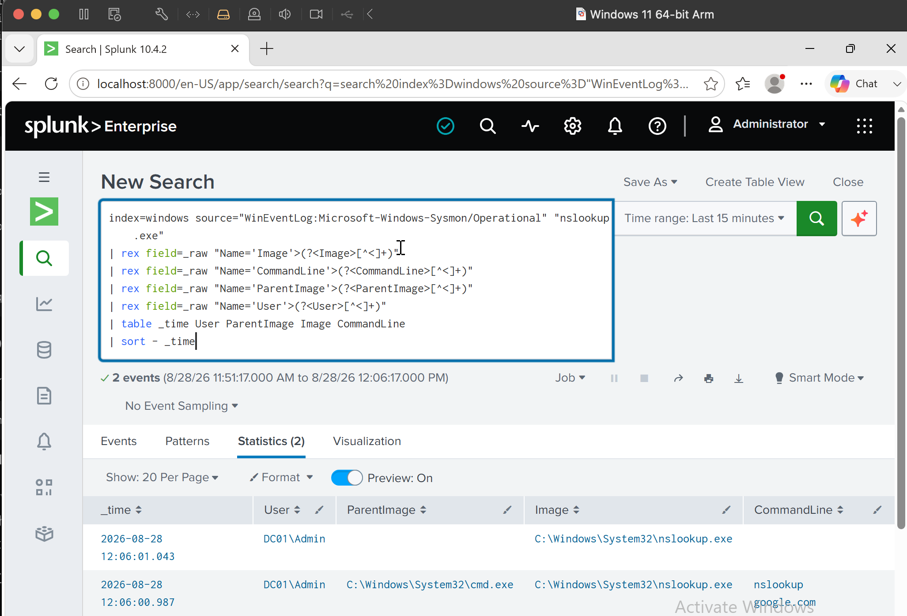

# Project 02 — SPL and Security Log Analysis

## Overview

After getting Windows and Sysmon logs into Splunk in Project 01, I used this lab to spend more time working with the data itself.

The focus was on getting comfortable with SPL while answering practical security questions: what logs are available, which security events occur most often, which accounts are logging on, what processes are running, and what PowerShell or DNS-related activity can be found on the endpoint.

I also worked with the raw Sysmon XML instead of relying on fields that Splunk had not automatically extracted.

---

## Checking the Available Logs

I started by checking what telemetry was available in the `windows` index.

```spl
index=windows
| stats count by source
| sort - count
```

The environment contained Windows Security, System and Application logs along with Sysmon endpoint telemetry.



This was a useful first step because it showed which data sources I could actually use before starting an investigation.

---

## Windows Security Event Analysis

I then looked at the Windows Security log and grouped events by Event Code.

```spl
index=windows source="WinEventLog:Security"
| stats count by EventCode
| sort - count
```



This made it easier to see which types of security events were occurring most frequently instead of reviewing individual events one by one.

---

## Successful Logon Analysis

I investigated successful Windows logons using Event ID `4624`.

One thing I noticed was that the useful account field in my Splunk data was `Account_Name`, rather than a generic `user` field.

I used:

```spl
index=windows source="WinEventLog:Security" EventCode=4624
| stats count by Account_Name Logon_Type
| sort - count
```



Looking at both the account and logon type gave more context than simply counting 4624 events.

For example, I observed service-related logons with `Logon_Type=5`, which helped distinguish normal system/service authentication from interactive user activity.

I also searched for failed logons using Event ID `4625`, but there were no matching events in the dataset at the time of the lab. I left this as an observation rather than generating results just for the documentation.

---

## Security Activity Over Time

Next, I used `timechart` to look at changes in Windows Security event volume.

```spl
index=windows source="WinEventLog:Security"
| timechart span=1h count
```



This helped me practise looking for changes or spikes in activity over time.

A higher event count by itself does not mean malicious activity, but it can identify a period that deserves a closer look.

---

## Host Telemetry

I also checked how much telemetry was being collected from the host and which sources were contributing to it.

```spl
index=windows
| stats count dc(source) as LogSources values(source) as Sources by host
```



This gave me a quick way to check the visibility available for `DC01` before moving into endpoint analysis.

---

## Sysmon Process Analysis

The Sysmon events in this lab were arriving as XML, and some of the fields I wanted were not automatically available in Splunk.

Instead of changing the data source, I used `rex` to extract the process image directly from `_raw`.

```spl
index=windows source="WinEventLog:Microsoft-Windows-Sysmon/Operational"
| rex field=_raw "Name='Image'>(?<ProcessImage>[^<]+)"
| where isnotnull(ProcessImage)
| stats count by ProcessImage
| sort - count
```



This was useful because it turned the raw Sysmon events into something I could actually analyse and compare.

---

## PowerShell Activity

I then focused on PowerShell activity.

Rather than searching only for `powershell.exe`, I extracted the user, process, parent process and command line.

```spl
index=windows source="WinEventLog:Microsoft-Windows-Sysmon/Operational" "powershell.exe"
| rex field=_raw "Name='Image'>(?<Image>[^<]+)"
| rex field=_raw "Name='CommandLine'>(?<CommandLine>[^<]+)"
| rex field=_raw "Name='ParentImage'>(?<ParentImage>[^<]+)"
| rex field=_raw "Name='User'>(?<User>[^<]+)"
| table _time User ParentImage Image CommandLine
| sort - _time
```



This gave much better investigation context:

```text
Time → User → Parent Process → PowerShell → Command Line
```

The main takeaway here was that seeing PowerShell in the logs does not make the activity malicious. The parent process, user, command line and surrounding events are what give it meaning.

---

## Looking for Rare Processes

I also used process frequency to look for less common executables.

```spl
index=windows source="WinEventLog:Microsoft-Windows-Sysmon/Operational"
| rex field=_raw "Name='Image'>(?<ProcessImage>[^<]+)"
| where isnotnull(ProcessImage)
| rare limit=20 ProcessImage
```



I treated this as a hunting technique rather than a detection rule.

A process being rare does not mean it is malicious. It simply gives me a smaller set of activity that may be worth reviewing.

---

## DNS-Related Process Activity

I had previously generated `nslookup` activity on the Windows host, so I used that to practise following command-line activity in Sysmon.

```spl
index=windows source="WinEventLog:Microsoft-Windows-Sysmon/Operational" "nslookup.exe"
| rex field=_raw "Name='Image'>(?<Image>[^<]+)"
| rex field=_raw "Name='CommandLine'>(?<CommandLine>[^<]+)"
| rex field=_raw "Name='ParentImage'>(?<ParentImage>[^<]+)"
| rex field=_raw "Name='User'>(?<User>[^<]+)"
| table _time User ParentImage Image CommandLine
| sort - _time
```



This helped connect endpoint activity with the command that initiated a DNS lookup rather than looking at individual events in isolation.

---

## SPL Used in This Lab

The main SPL commands I worked with were:

```text
search
table
stats
sort
top
rare
dedup
rex
eval
where
timechart
```

I saved the useful searches from the lab in:

```text
Queries/soc-analysis-queries.spl
```

The important part for me was not memorising SPL commands individually. It was getting used to turning a security question into a search and then narrowing the results until I had useful context.

---

## What I Took From This Lab

This lab moved me from simply collecting logs to actually working with them.

I practised analysing authentication activity, comparing security events over time, extracting fields from raw Sysmon XML, reviewing process frequency, investigating PowerShell command lines and looking for uncommon endpoint activity.

I also got more comfortable checking the data before making assumptions. The missing `4625` events were a good example: no failed-logon events were available, so there was nothing to investigate rather than a reason to force a conclusion.

The next project will go deeper into **Windows Security Event analysis** and use individual Event IDs to understand account, authentication, privilege and process activity.