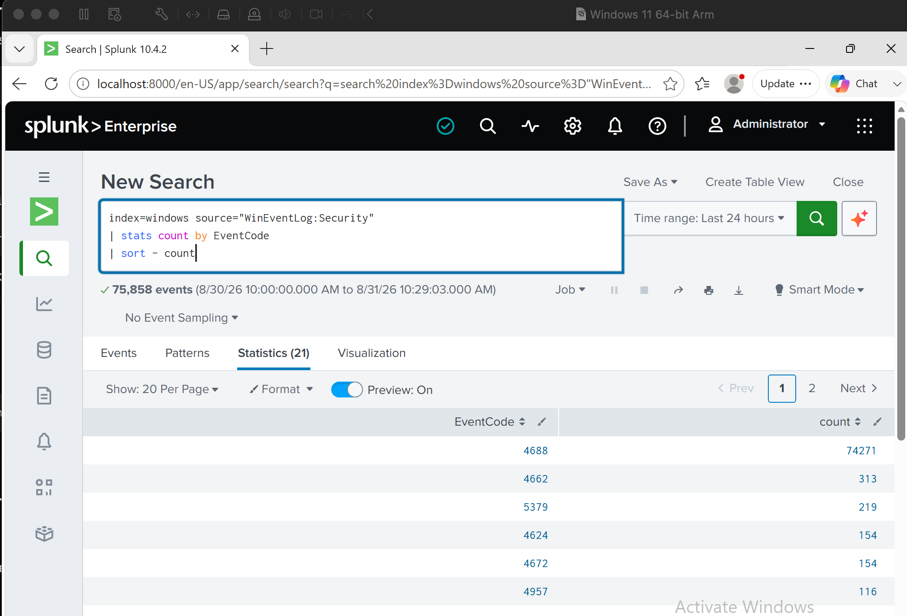
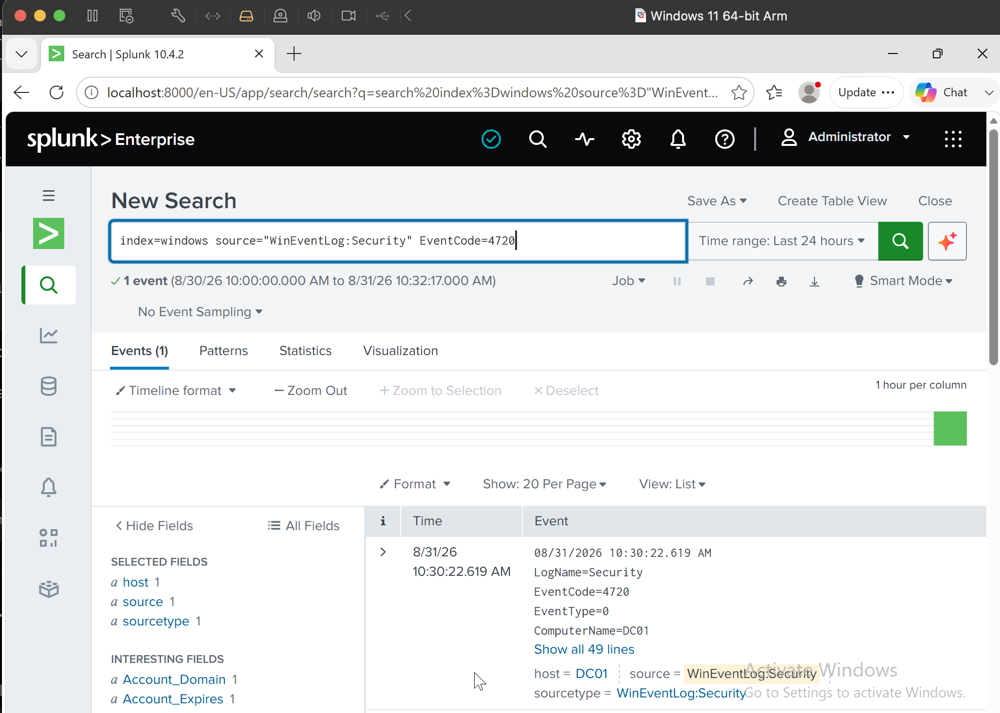
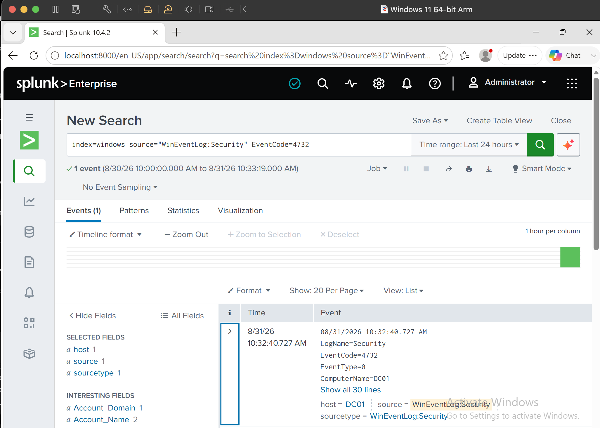
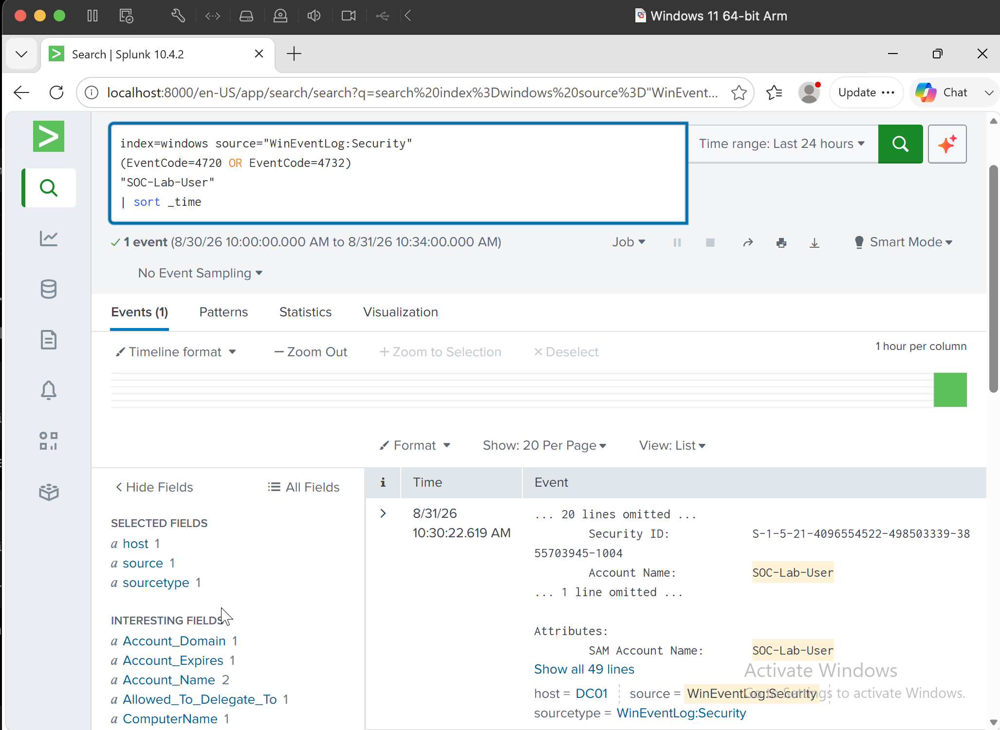
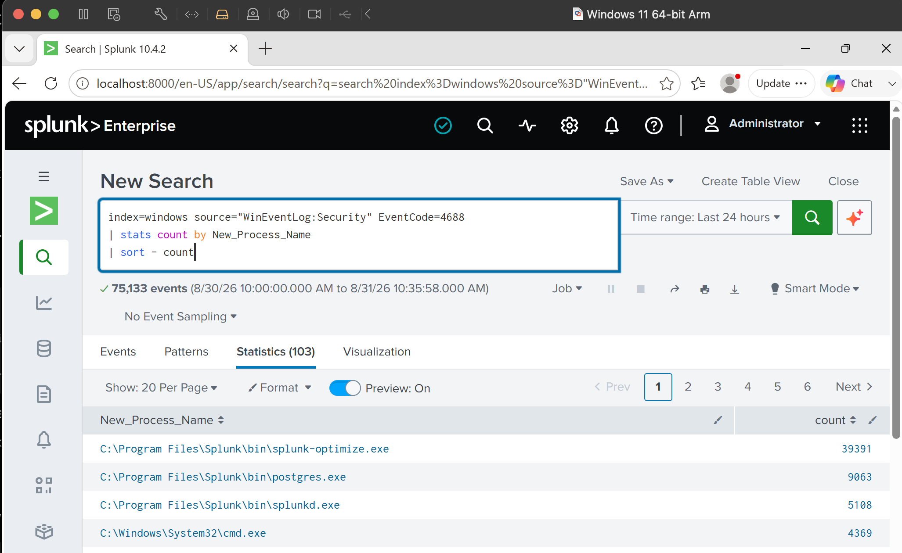
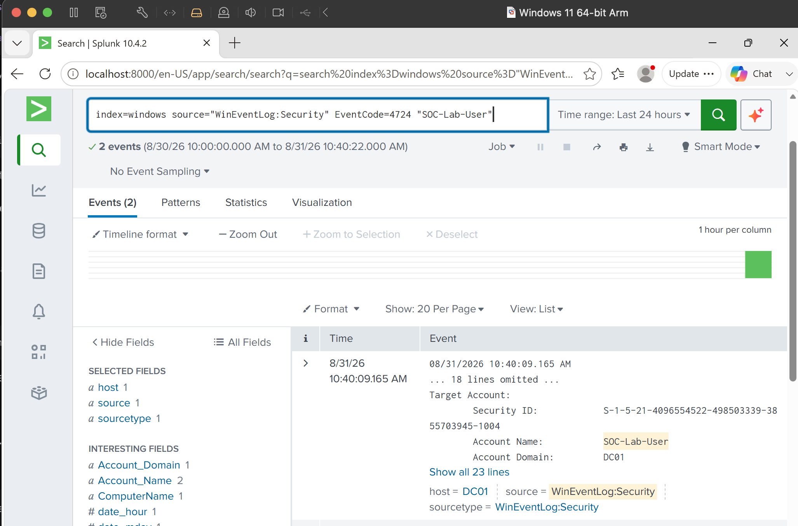
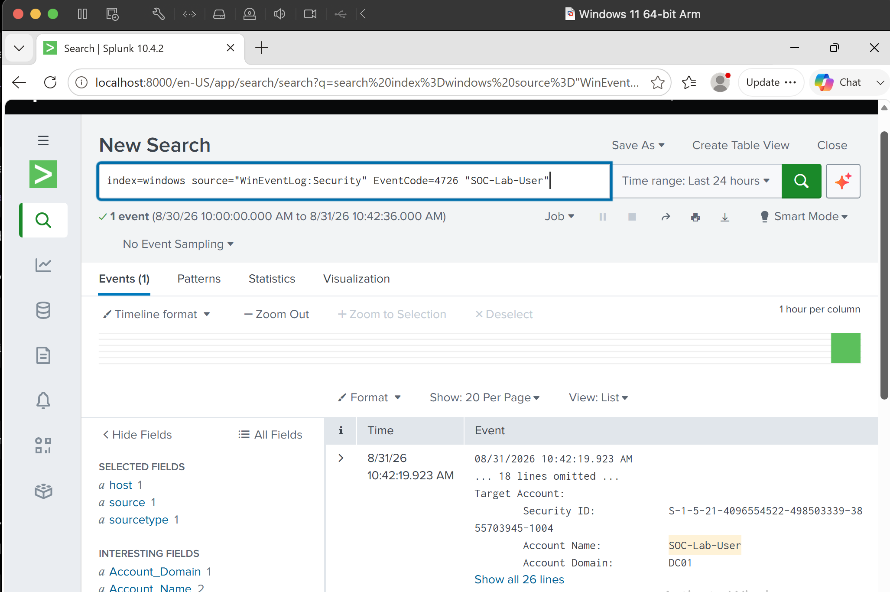
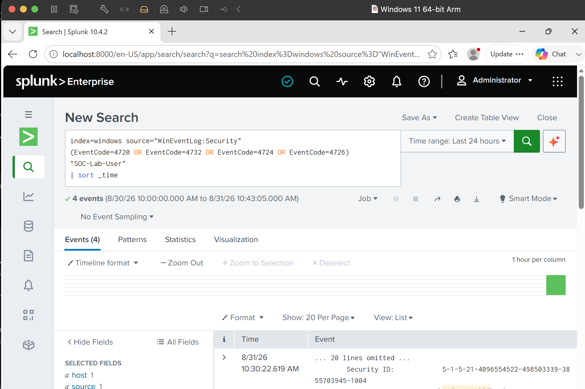

# Project 03 — Windows Security Event Analysis

## Overview

In this lab I used Splunk to investigate Windows Security events generated by controlled activity on my Windows host.

Instead of only searching Event IDs, I created a temporary test account and followed its activity through the Security log. This gave me a simple account lifecycle to investigate: account creation, administrative group membership changes, password activity and eventual account deletion.

I also looked at privileged logons and Windows process creation events.

---

## Security Event Baseline

I started by checking which Windows Security Event IDs were being collected.

```spl
index=windows source="WinEventLog:Security"
| stats count by EventCode
| sort - count
```



This gave me a quick picture of the security activity available before generating the test events.

---

## Investigating Account Creation

I created a temporary local account called:

```text
SOC-Lab-User
```

I then searched Splunk for Event ID `4720`.

```spl
index=windows source="WinEventLog:Security" EventCode=4720 "SOC-Lab-User"
```



The event allowed me to identify the account creation and review information about the account, host, timestamp and the account responsible for the action.

This is more useful than simply knowing that 4720 means an account was created. During an investigation I would want to know whether the account was expected and who created it.

---

## Administrative Group Membership Change

I then added the test account to the local Administrators group.

This generated Event ID `4732`.

```spl
index=windows source="WinEventLog:Security" EventCode=4732 "SOC-Lab-User"
```



An account being created is one event worth reviewing. A newly created account being given administrative access shortly afterwards provides much more useful security context.

---

## Correlating the Events

Instead of treating the account creation and group change separately, I searched for both events together.

```spl
index=windows source="WinEventLog:Security"
(EventCode=4720 OR EventCode=4732)
"SOC-Lab-User"
| sort _time
```



This produced a simple sequence:

```text
Account created
      ↓
Added to Administrators
```

This was one of the more useful parts of the lab because it showed how separate Windows events can become more meaningful when they are correlated by account and time.

---

## Windows Process Creation

I also analysed Event ID `4688`, which was available in the Windows Security telemetry.

```spl
index=windows source="WinEventLog:Security" EventCode=4688
| stats count by New_Process_Name
| sort - count
```



The `New_Process_Name` field was already populated in my environment, so I could use it directly to see which executables were creating the most process events.

I also searched for processes such as PowerShell, CMD and Notepad.

```spl
index=windows source="WinEventLog:Security" EventCode=4688
(New_Process_Name="*powershell.exe" OR
 New_Process_Name="*cmd.exe" OR
 New_Process_Name="*notepad.exe")
| table _time Account_Name New_Process_Name Process_Command_Line
| sort - _time
```

This also gave me a useful comparison with the Sysmon telemetry used in the previous project. Windows Security logs can provide process creation evidence, while Sysmon can provide additional endpoint context for deeper investigations.

---

## Password Activity

I changed the password of the temporary account and searched for the corresponding account-management event.

```spl
index=windows source="WinEventLog:Security" EventCode=4724 "SOC-Lab-User"
```



This gave me another account-management event that could be placed into the same investigation timeline.

---

## Account Deletion

After completing the tests, I removed the temporary account.

I searched for Event ID `4726` to confirm the deletion was visible in Splunk.

```spl
index=windows source="WinEventLog:Security" EventCode=4726 "SOC-Lab-User"
```



This also cleaned up the temporary account that I had created for the lab.

---

## Account Lifecycle Timeline

Finally, I searched the account-management events together.

```spl
index=windows source="WinEventLog:Security"
(EventCode=4720 OR EventCode=4732 OR EventCode=4724 OR EventCode=4726)
"SOC-Lab-User"
| sort _time
```



This allowed me to follow the test account through its lifecycle rather than reviewing each event in isolation:

```text
Account created
      ↓
Administrative access added
      ↓
Password changed
      ↓
Account deleted
```

Because I generated the activity myself, I knew this sequence was legitimate lab activity. In a real investigation, the same pattern involving an unexpected account would require validation and potentially escalation.

---

## What I Took From This Lab

The useful part of this project was seeing how Windows Security events relate to each other.

A single account creation or privileged event does not automatically indicate malicious activity. The account involved, the person or process responsible, the timing, privilege changes and surrounding events provide the context needed to make an assessment.

I also became more comfortable using Splunk to move from an individual Windows event to a timeline of related activity.

The next project takes this further by generating and investigating **failed authentication activity**.