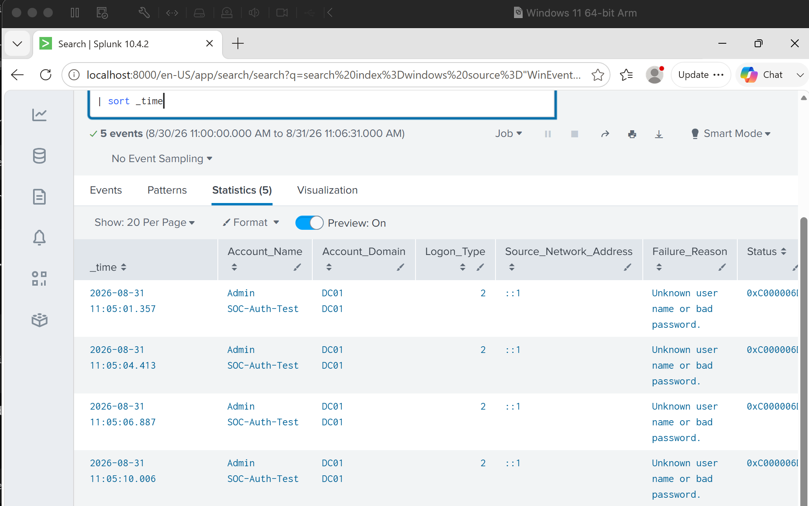
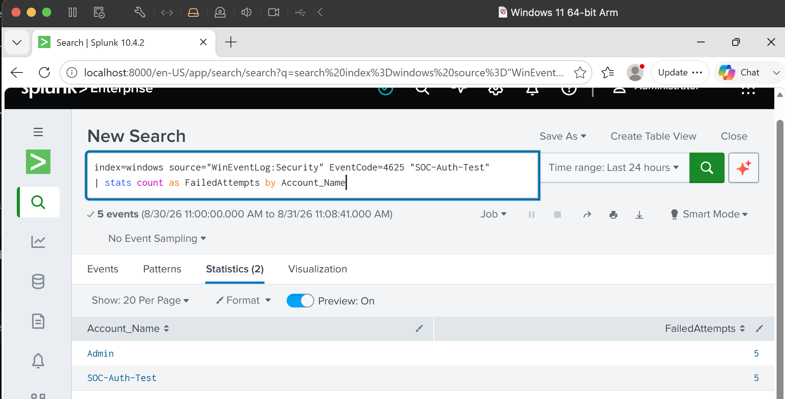
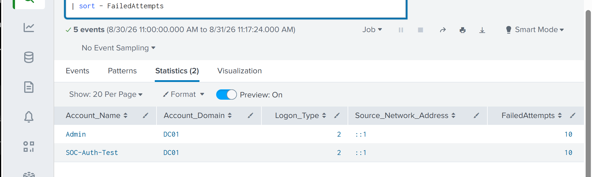
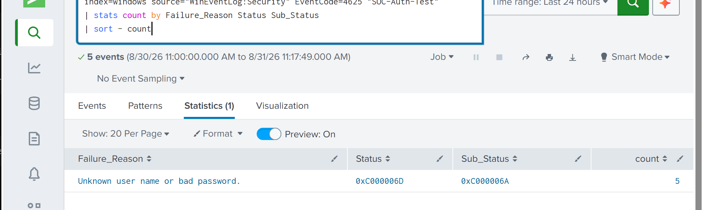
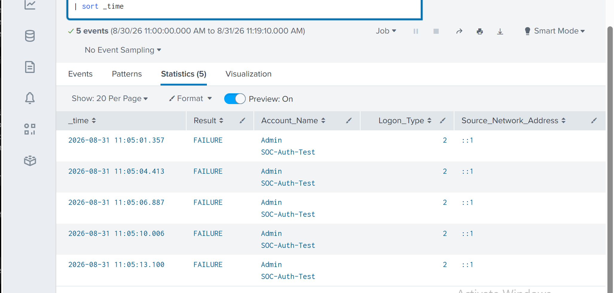

# Project 04 — Authentication Attack Investigation

## Overview

In this lab I investigated repeated failed authentication attempts using Windows Security logs in Splunk.

Rather than only searching for Event ID 4625, I treated the activity like a small SOC investigation. I identified the targeted account, reviewed the failure pattern and source information, checked whether authentication eventually succeeded, and documented an analyst verdict.

The activity was intentionally generated in my lab so I knew the ground truth.

## Failed Authentication Activity

I generated several incorrect authentication attempts against a temporary account named `SOC-Auth-Test`.

The activity appeared in Splunk as Windows Security Event ID `4625`.



I reviewed the available authentication fields to understand what generated the failures rather than treating every 4625 event as malicious.

## Counting the Attempts

I used SPL to count the failures associated with the account.

```spl
index=windows source="WinEventLog:Security" EventCode=4625 "SOC-Auth-Test"
| stats count as FailedAttempts by Account_Name
```



This is a simple query, but it becomes useful when distinguishing an isolated password mistake from repeated authentication failures.

## Source Analysis

I then grouped the events using the account, domain, logon type and available source information.



This provided more context around where and how the authentication attempts occurred.

## Why Authentication Failed

The failure reason and Windows status information were also reviewed.



This helped confirm that I was looking at authentication failures rather than assuming the reason based only on the Event ID.

## Checking for Successful Access

One of the most important parts of the investigation was checking whether a successful authentication occurred after the failures.

```spl
index=windows source="WinEventLog:Security"
(EventCode=4624 OR EventCode=4625)
"SOC-Auth-Test"
| eval Result=if(EventCode=4624,"SUCCESS","FAILURE")
| table _time Result Account_Name Logon_Type Source_Network_Address
| sort _time
```



I observed the failed authentication events but did not identify a successful 4624 authentication for the test account following them.

Based on the available evidence, there was no indication that access was gained.

## Analyst Assessment

**Verdict: Suspicious authentication activity — unsuccessful**

The repeated failures were consistent with password-guessing behaviour, although in this case they were intentionally generated as part of the lab.

In a real SOC environment, I would continue investigating the source, affected account, surrounding authentication activity and any endpoint events before deciding whether escalation or containment was required.

## Investigation Report

A separate investigation report documents the triage process, evidence, assessment, MITRE ATT&CK context, escalation decision and recommended response.

See:

`Investigation/authentication-attack-investigation.md`

## What I Took From This Lab

The main lesson was that finding Event ID 4625 is only the beginning of an authentication investigation.

What matters is determining who was targeted, where the attempts came from, why they failed, whether the pattern is unusual and, most importantly, whether successful access occurred afterward.