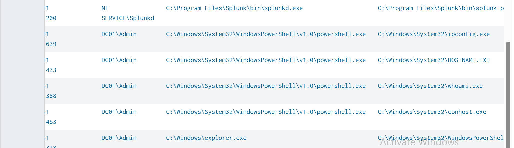
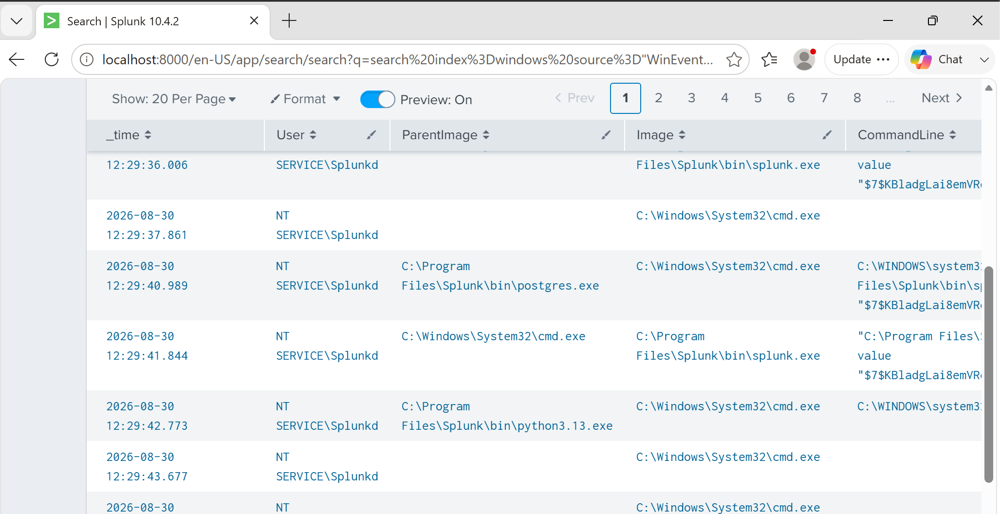
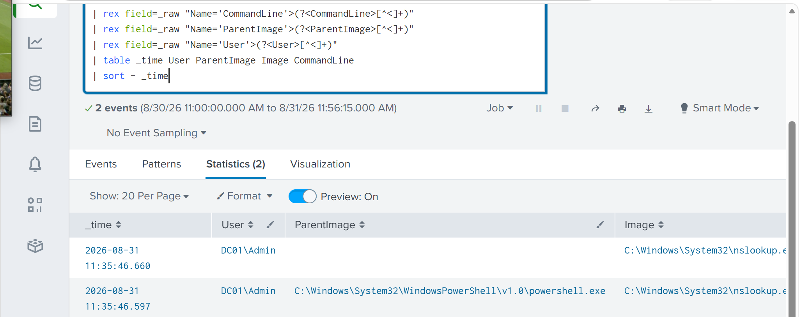
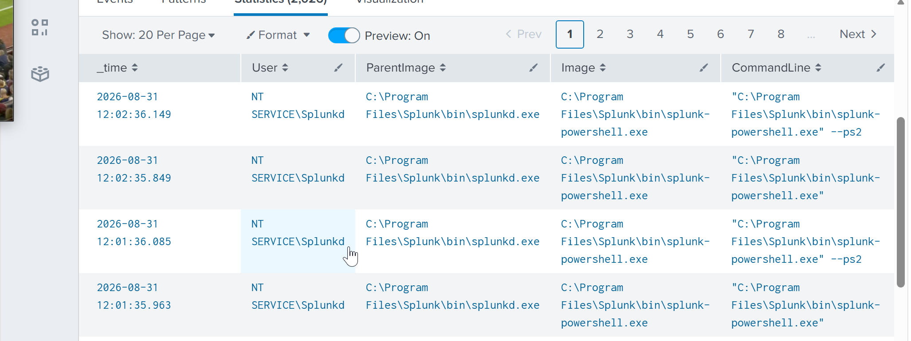
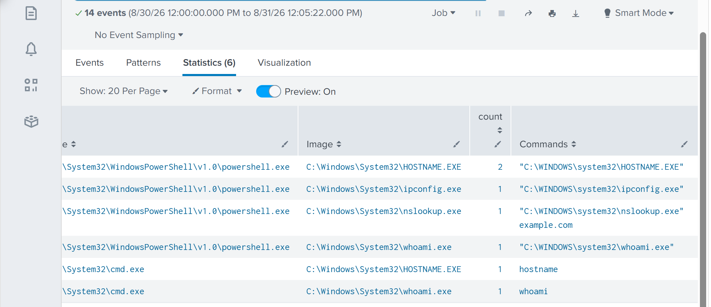

# Project 05 — Endpoint, PowerShell & Network Investigation

## Overview

In this lab I investigated PowerShell and related endpoint activity using Sysmon telemetry in Splunk.

I generated controlled activity and followed the process relationships, command lines, discovery commands, DNS activity and available network telemetry.

## PowerShell Activity

I started by reviewing PowerShell execution together with the user, parent process and command line.

PowerShell itself is not malicious, so the goal was to understand what it was doing and what processes appeared around it.

## Parent and Child Processes

I investigated related processes including `cmd.exe`, `whoami.exe`, `hostname.exe`, `ipconfig.exe` and `nslookup.exe`.

Looking at these relationships helped reconstruct the sequence of activity instead of treating each process as a separate event.

## DNS Activity

I then investigated the `nslookup.exe` activity generated during the test.

This connected DNS-related behaviour back to the endpoint process responsible for it.

## PowerShell Command Lines

Command-line information provided more context about how PowerShell was being used.

## Discovery Commands

Finally, I grouped the discovery processes to understand the overall behaviour.

The combination of user discovery, system discovery and network configuration discovery was more useful to investigate than any single command.

## Assessment

**Verdict: Suspicious-looking endpoint activity — benign controlled activity**

The activity was intentionally generated. In a real environment, an unexpected sequence of PowerShell, discovery commands and related network activity would require additional investigation.

A separate investigation report contains the evidence, assessment, MITRE ATT&CK mapping and escalation decision:

`Investigation/endpoint-powershell-investigation.md`

## What I Took From This Lab

The biggest takeaway was learning to investigate behaviour rather than automatically treating tools such as PowerShell or CMD as malicious.

Process relationships, command lines, user context and surrounding activity are what make the events meaningful.