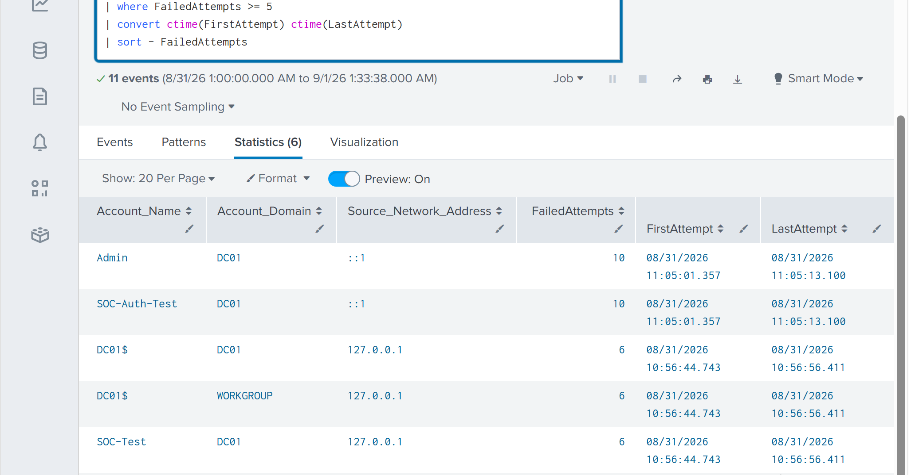
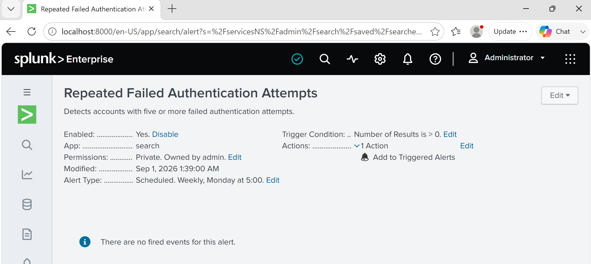
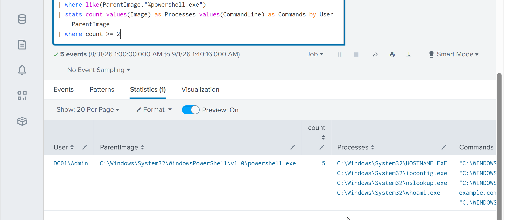
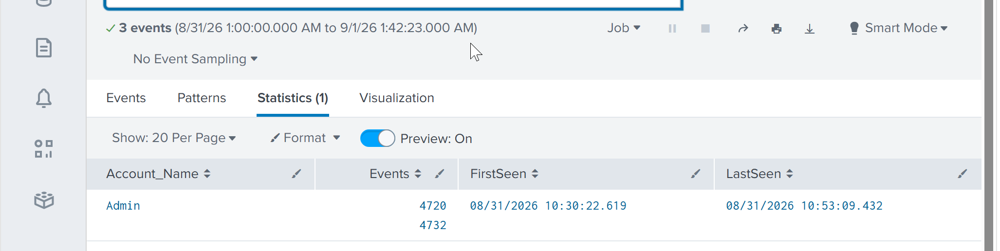
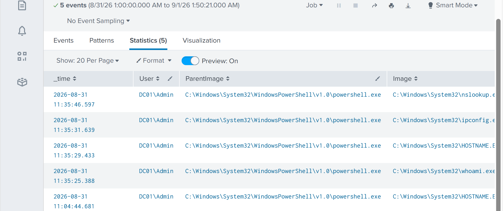
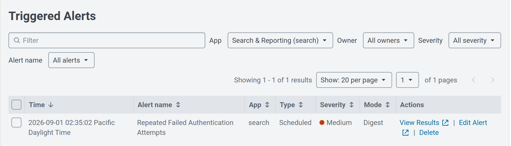

# Detection Engineering, Alerting & Sigma-to-Splunk

## Overview

This lab moved from searching logs manually to building detections that could actually support SOC monitoring.

I used Windows Security and Sysmon telemetry already being collected in Splunk to build detections for failed authentication, PowerShell discovery activity, and account privilege changes. I also translated Sigma-style detection logic into SPL and configured one of the detections as a scheduled Splunk alert.

The main focus was keeping the detections simple enough to understand, test, and investigate.

---

## Repeated Failed Authentication

I started with Windows Event ID 4625 and looked for accounts generating five or more failed authentication attempts.

```spl
index=windows source="WinEventLog:Security" EventCode=4625
| stats count as FailedAttempts
        min(_time) as FirstAttempt
        max(_time) as LastAttempt
        by Account_Name Account_Domain Source_Network_Address
| where FailedAttempts >= 5
| convert ctime(FirstAttempt) ctime(LastAttempt)
| sort - FailedAttempts
```



The five-attempt threshold was chosen for this lab. In a real environment, it would need to be tuned around normal authentication behaviour and false positives.

---

## Creating the Splunk Alert

I converted the failed-authentication search into a scheduled alert.

The alert runs every five minutes, searches the previous 15 minutes, and triggers when the detection returns a result.



This helped me understand the difference between writing a useful search and turning that search into something Splunk can monitor automatically.

---

## PowerShell Discovery Activity

The second detection looked for common discovery tools launched from PowerShell, including:

- `whoami.exe`
- `hostname.exe`
- `ipconfig.exe`
- `nslookup.exe`



These commands are not malicious by themselves. The detection is meant to highlight a sequence of activity that could be worth investigating depending on the user, host and surrounding events.

---

## Account and Privilege Change Detection

I also correlated account creation and local group membership activity using Windows Security events 4720 and 4732.



This gives more context than looking at account creation alone. A newly created account followed by a privileged group change would deserve closer review in a production environment.

---

## Sigma to Splunk

For the final detection exercise, I represented PowerShell discovery behaviour as a Sigma-style rule and then adapted the same logic to the fields available in my Splunk/Sysmon data.

Because the Sysmon XML fields in this lab were not automatically extracted cleanly, I used `rex` in SPL to extract the fields needed for the detection.



This was useful because the Sigma logic could not simply be copied into Splunk. I had to understand what the rule was looking for and map that behaviour to the telemetry I actually had.

---

## Alert Validation

I generated a controlled set of failed authentication attempts and confirmed that the scheduled detection triggered successfully in Splunk.



The final workflow was:

**Windows event → Splunk ingestion → SPL detection → threshold match → scheduled alert → triggered alert**

---

## Detection Coverage

| Detection | Data Source | ATT&CK |
|---|---|---|
| Repeated failed authentication | Windows Security 4625 | T1110 - Brute Force |
| PowerShell discovery activity | Sysmon | T1059.001, T1033, T1082, T1016 |
| Account creation and group change | Windows Security 4720/4732 | T1136, T1098 |
| Sigma-to-Splunk discovery detection | Sysmon | Discovery / PowerShell |

---

## What I Took From This Lab

The biggest takeaway was that a detection is more than an SPL query.

The logic needs to match the available telemetry, produce something useful for an analyst, and be tested against actual events. Thresholds and severity also need context rather than being treated as universal values.

Getting the scheduled authentication alert to fire end-to-end was the most useful part of the lab because it connected log analysis, detection engineering and SOC monitoring in one workflow.