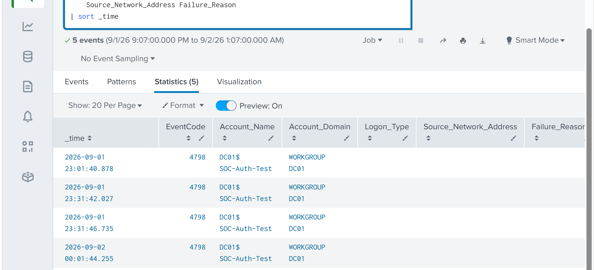
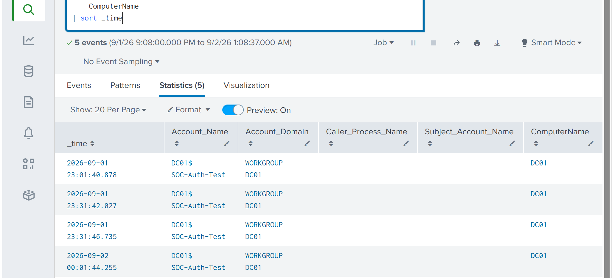
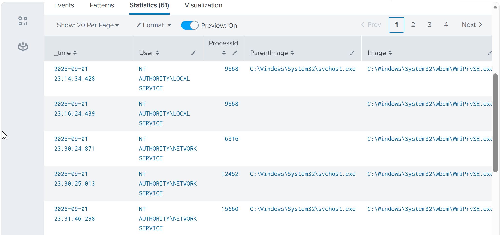
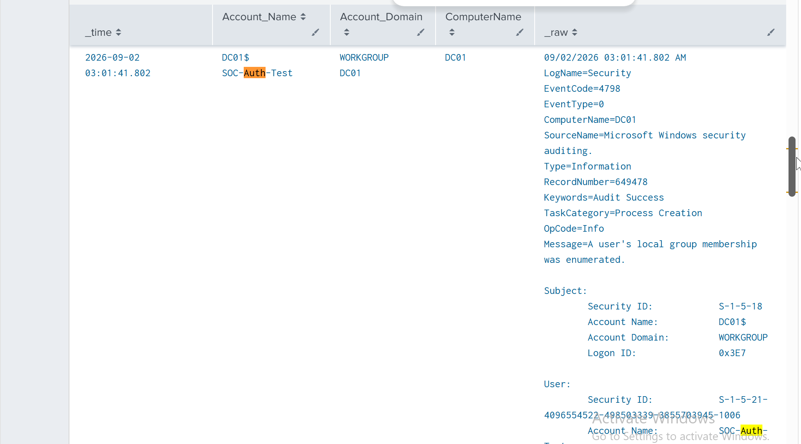

# SOC Incident Investigation & Response

## Overview

This lab was focused on investigating an alert from start to finish rather than just writing another detection.

I used the repeated failed-authentication alert from the previous lab as the starting point and investigated the affected account across Windows Security and Sysmon telemetry.

The goal was to decide whether the alert represented compromise, needed escalation, or could be closed.

## Initial Triage

The investigation started with the `SOC-Auth-Test` account.



The account was reviewed across the available Windows Security events. During the current investigation window, Event ID 4798 was identified.

## Account Group Enumeration

Event ID 4798 records enumeration of a user's local group membership.

Reviewing the raw event showed the caller process as:

```text
C:\Windows\System32\wbem\WmiPrvSE.exe
```



`WmiPrvSE.exe` is a legitimate Windows component, so I did not treat the process name alone as evidence of malicious activity.

## Process Pivot

I then pivoted into Sysmon to look for related process activity.



One important part of this investigation was avoiding an incorrect PID correlation.

The PID from the Security event also appeared in other Sysmon data, but it was associated with different process instances at different times. I therefore did not use the matching PID number alone to claim that the events were related.

No suspicious process chain could be established from the available evidence.

## Authentication Correlation

I also searched for Event IDs 4624 and 4625 associated with `SOC-Auth-Test` during the current investigation window.

The search did not return matching authentication events in the available data.

Because of this, I did not claim that successful access occurred or that the failed authentication sequence could be reconstructed from the current investigation window.

## Enumeration Context

I compared Event ID 4798 activity across other accounts.



Eight accounts appeared in 4798 events, while `SOC-Auth-Test` appeared once.

That context reduced the significance of the single enumeration event and provided no strong evidence that the account was being specifically targeted.

## Analyst Verdict

**Benign / Controlled Activity**

The original authentication failures were generated intentionally as part of the detection lab.

During the investigation I found no evidence supporting:

- successful unauthorized access
- malicious process execution
- suspicious follow-on activity
- account-specific repeated enumeration

The 4798 event was investigated but was not enough to increase the incident severity.

## Escalation Decision

**No escalation required.**

In a production SOC, I would escalate similar activity if the failed authentication attempts were followed by successful access, involved a privileged account, originated from an unusual source, or correlated with suspicious endpoint activity.

## Investigation Report

The full case report is available here:

`Investigation/SOC-IR-001-authentication-investigation.md`

## What I Took From This Lab

The useful part of this investigation was not finding something malicious. It was deciding what the evidence actually supported.

I had to pivot between Windows Security and Sysmon, inspect raw events when fields were missing, avoid an incorrect PID correlation, compare the event against normal activity, and make an escalation decision.

That felt much closer to alert triage than simply running a prepared SPL search.