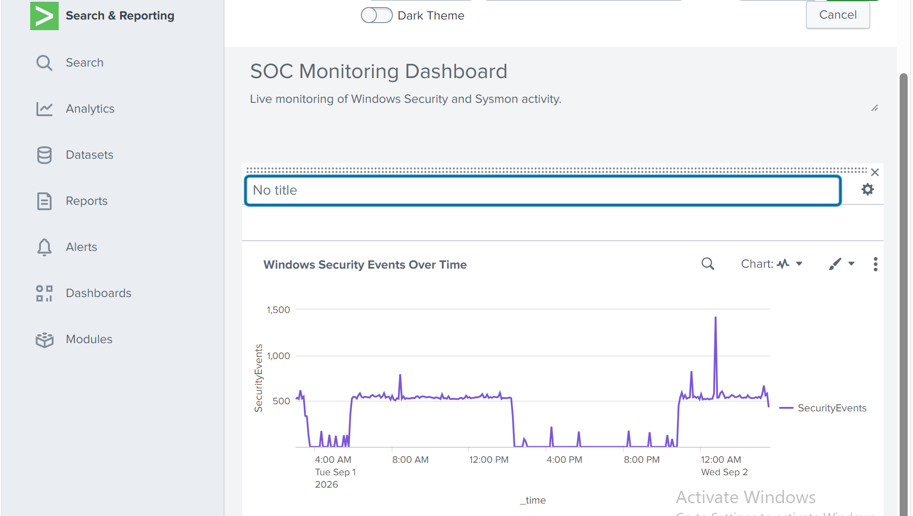
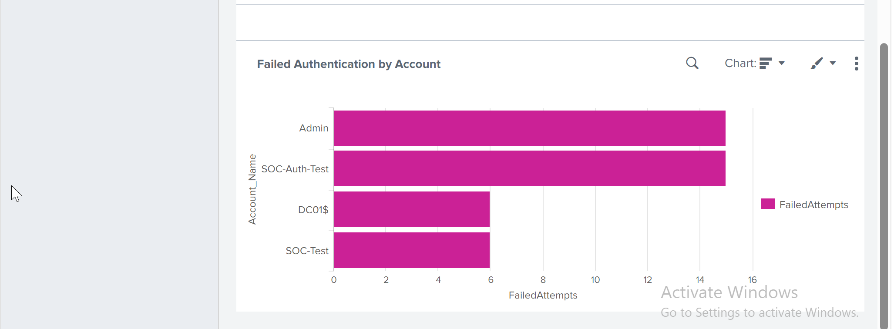
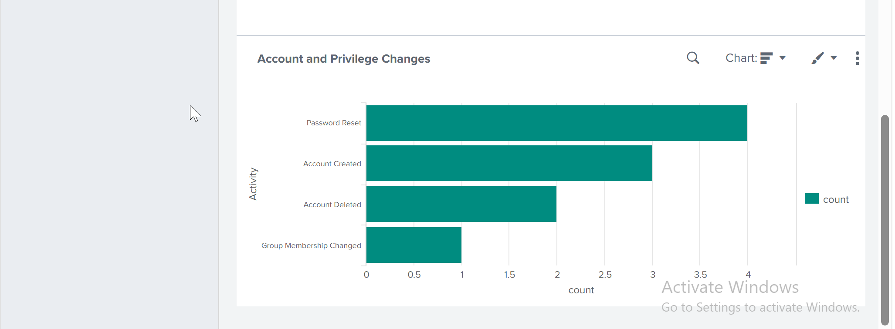
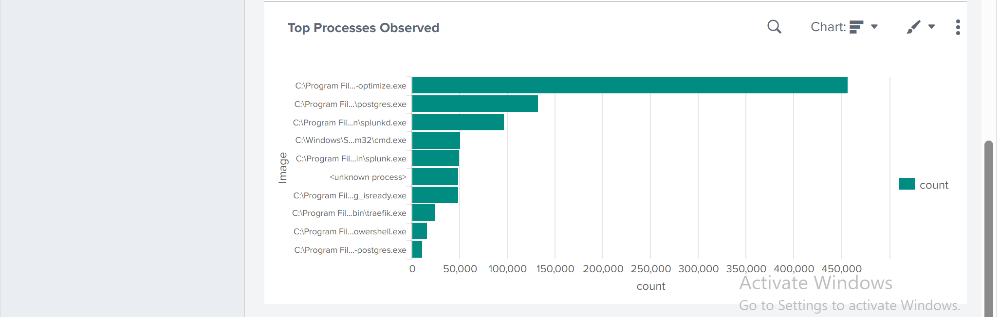
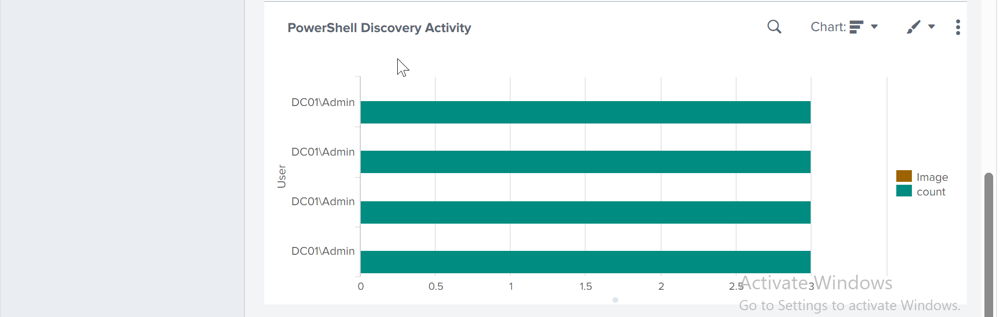
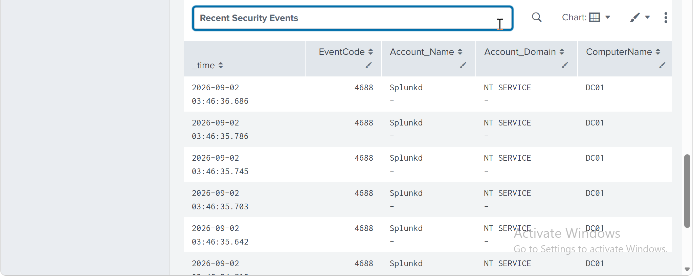
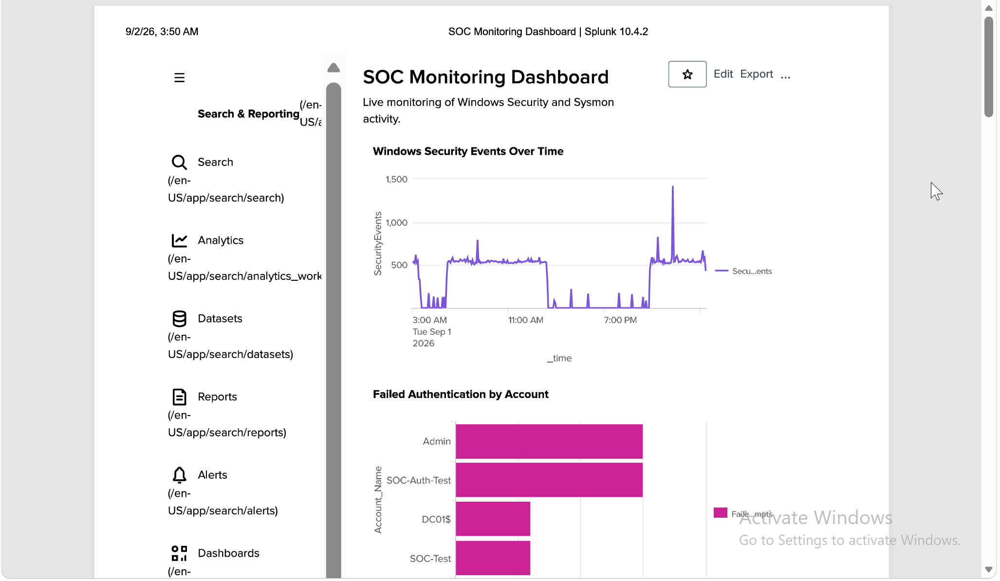

# MITRE ATT&CK & Live SOC Dashboard

## Overview

This lab brought together the Windows Security and Sysmon telemetry used throughout the Splunk project into one monitoring dashboard.

The goal was not to build a large dashboard with every available metric. I focused on information that would actually help during SOC monitoring: authentication failures, account changes, endpoint processes, PowerShell discovery activity and recent security events.

I also mapped the behaviours used in the previous detection and investigation labs to MITRE ATT&CK.

## Security Event Monitoring

The first panel tracks Windows Security event volume over time.

This gives a quick view of changes in security-event activity and provides a starting point for further investigation.

## Failed Authentication

I added a view of failed authentication attempts grouped by account.

This makes it easier to identify accounts producing unusually high numbers of failed logons.

## Account and Privilege Changes

The dashboard also monitors account creation, password resets, account deletion and group membership changes.

These events are not automatically suspicious, but they are useful when investigating identity-related activity.

## Endpoint Process Activity

Sysmon telemetry is used to display the most frequently observed processes.

This gives some basic endpoint context and helps confirm that Sysmon process telemetry is continuously reaching Splunk.

## PowerShell Discovery Activity

A separate panel focuses on discovery utilities launched from PowerShell.

The panel looks for tools such as `whoami`, `hostname`, `ipconfig` and `nslookup` where PowerShell is the parent process.

These tools are legitimate, so the dashboard is intended to highlight behaviour for review rather than automatically classify it as malicious.

## Authentication KPI

I added a single-value panel showing the number of failed authentication attempts within the selected dashboard time range.

This gives a quick authentication-health indicator without needing to open another search.

## Recent Security Events

The final panel provides a recent Windows Security event feed.

This gives an analyst a simple place to inspect recent activity before pivoting into a more detailed search.

## Live SOC Dashboard

The completed dashboard combines the main monitoring views into one screen.

Because the searches use the `windows` index directly, the dashboard updates as new Windows Security and Sysmon events are ingested into Splunk.

## MITRE ATT&CK Mapping

I mapped the behaviours covered in the Splunk labs to relevant MITRE ATT&CK techniques.

The mapping is stored in:

`MITRE/detection-attack-mapping.md`

ATT&CK was used to describe observed behaviour rather than as proof that an attack occurred.

## What I Took From This Lab

The main lesson was that a useful SOC dashboard should support investigation rather than just look impressive.

The most useful panels were the ones that helped answer simple analyst questions quickly: which accounts are failing authentication, what account changes are happening, what endpoint processes are active, and whether PowerShell discovery behaviour is appearing.

Combining the dashboard with ATT&CK mapping also helped connect monitoring, detection and investigation into one workflow.