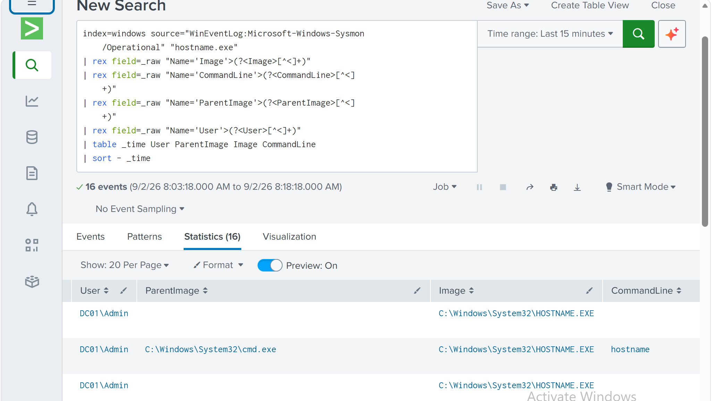
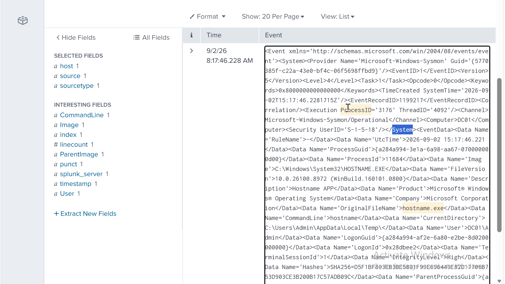
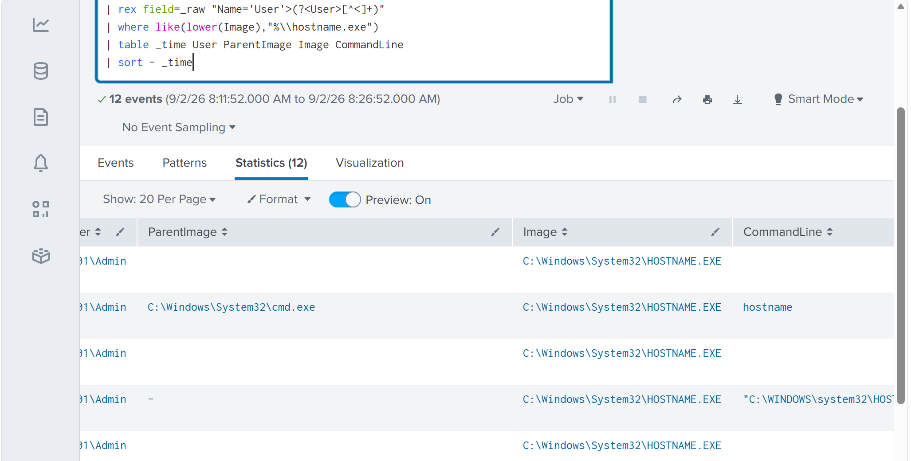
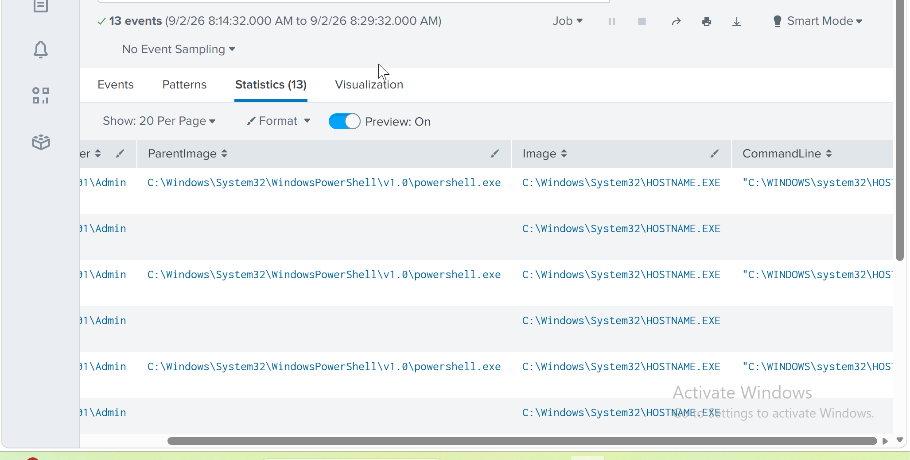

# Atomic Red Team Detection & Investigation

## Overview

This lab was the final technical exercise in the Splunk SOC investigation project.

I used Atomic Red Team to generate controlled System Information Discovery activity on the Windows endpoint, then followed the resulting telemetry through Sysmon and Splunk.

The goal was to validate the full workflow:

**Atomic test → endpoint telemetry → Splunk detection → process investigation → ATT&CK mapping → analyst verdict**

---

## Atomic Red Team Test

I used:

`T1082-7 — Hostname Discovery (Windows)`

The test executed `hostname.exe` on DC01.

After running the Atomic test, fresh Sysmon telemetry appeared in Splunk.



---

## Process Investigation

I reviewed the process details around the hostname execution.

The observed process relationship included:

```text
cmd.exe
   └── hostname.exe
```



This gave additional context beyond simply detecting the executable name.

---

## Detection

I built a simple SPL detection for hostname discovery activity.

```spl
index=windows source="WinEventLog:Microsoft-Windows-Sysmon/Operational"
| rex field=_raw "Name='Image'>(?<Image>[^<]+)"
| rex field=_raw "Name='ParentImage'>(?<ParentImage>[^<]+)"
| rex field=_raw "Name='CommandLine'>(?<CommandLine>[^<]+)"
| rex field=_raw "Name='User'>(?<User>[^<]+)"
| where like(lower(Image),"%\\hostname.exe")
| table _time User ParentImage Image CommandLine
| sort - _time
```



The search detects the behaviour, but it does not assume that every execution of `hostname.exe` is malicious.

---

## Surrounding Activity

I reviewed telemetry around the Atomic execution to check for related activity.



The activity matched the expected controlled discovery behaviour and no suspicious follow-on activity was identified.

---

## MITRE ATT&CK

The Atomic test maps to:

**T1082 — System Information Discovery**

ATT&CK was used to describe the observed behaviour rather than to label the endpoint as compromised.

---

## Analyst Verdict

**Detection Result: True Positive**

The Splunk detection correctly identified the discovery activity generated by Atomic Red Team.

**Incident Verdict: Benign / Controlled Activity**

The activity was authorized and intentionally generated for the lab.

No evidence of unauthorized access, compromise or suspicious follow-on behaviour was identified.

---

## Investigation Report

The complete investigation is documented in:

`Investigation/atomic-red-team-investigation.md`

---

## What I Took From This Lab

The most useful part was seeing the complete detection lifecycle.

Instead of stopping after running an Atomic test, I checked whether the endpoint generated telemetry, confirmed Splunk received it, built a detection around the behaviour, reviewed the process context and made an analyst decision.

It also reinforced an important SOC lesson: a true-positive detection does not automatically mean a malicious incident.